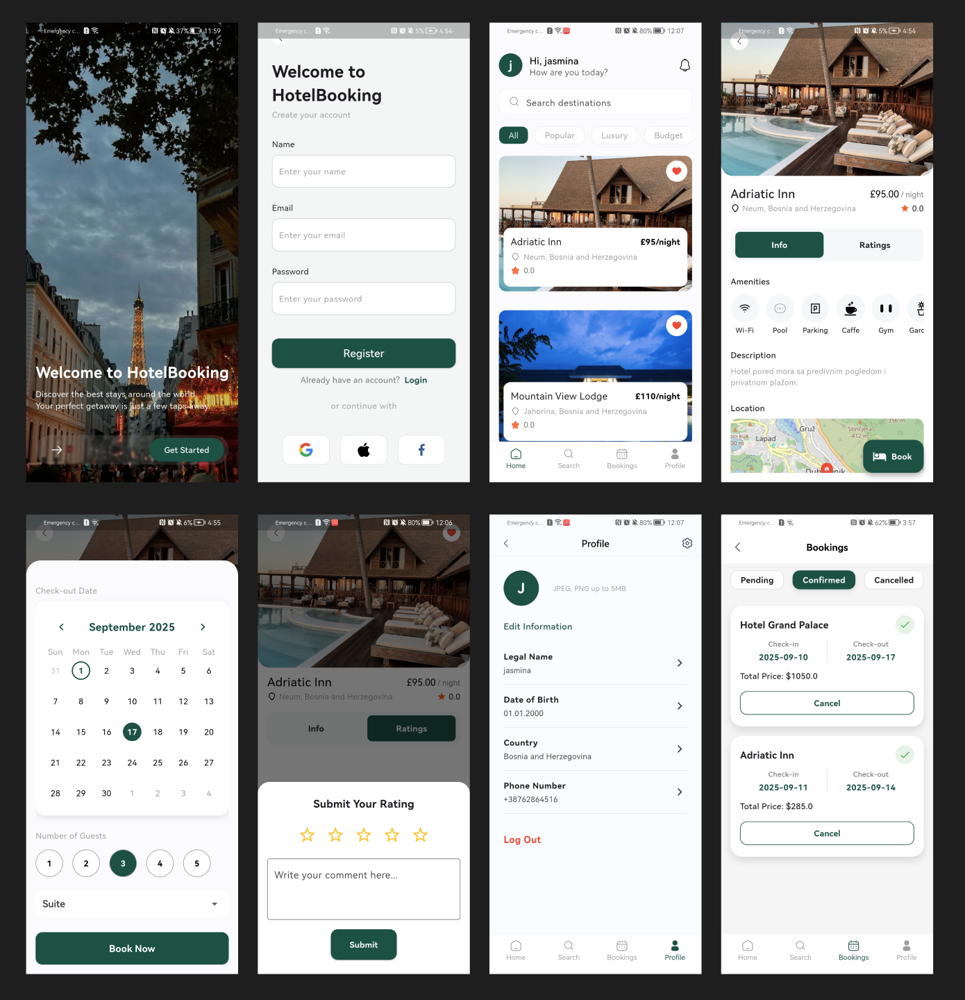

# 🏨 Hotel Booking App

A Flutter-based hotel booking application that allows users to search, view, and book hotels with a smooth and modern experience.  
The app includes essential features such as login, hotel browsing, reservations, personal information management, payments, and cancellations.  

---

##  Features

- 🔑 **User Authentication** – Secure login and registration.  
- 🏨 **Hotel Browsing** – Explore available hotels with detailed info.  
- 📅 **Reservations** – Book rooms quickly and easily.  
- 👤 **Profile Management** – Add and edit personal information.  
- 💳 **Payments** – Integrated payment flow for hotel bookings.  
- ❌ **Cancellations** – Cancel reservations with one click.  
- 🚀 **Modern Navigation** – Powered by GoRouter with shell routes.  

---

## 🛠️ Tech Stack

- **Flutter** – Cross-platform UI framework  
- **Supabase** – Backend as a service (auth + database)  
- **Flutter Hooks** – Simplified state management and lifecycle handling  
- **GoRouter** – Declarative and scalable navigation with shell routes  

---

## 📸 Screenshots

Here is an example of the app:

👉 More  screens are available on the following Figma link:  
[Figma Project Link](https://www.figma.com/design/gYUxik8TtpbHA8TE6tl62t/HotelBooking?node-id=0-1&p=f&t=zcvOJa1qUEaxCyH4-0)

